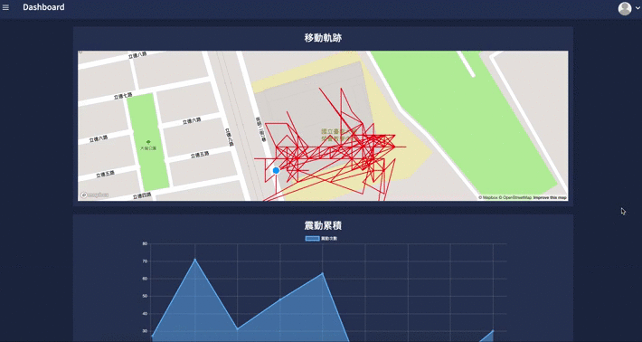
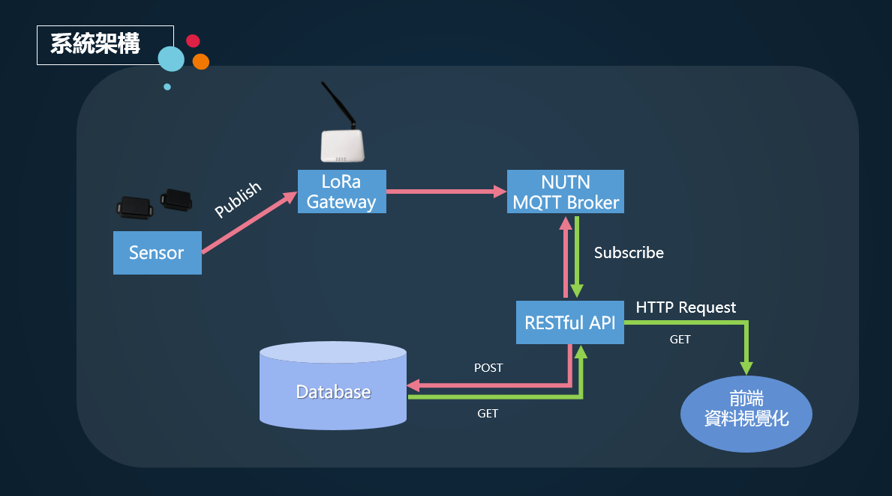
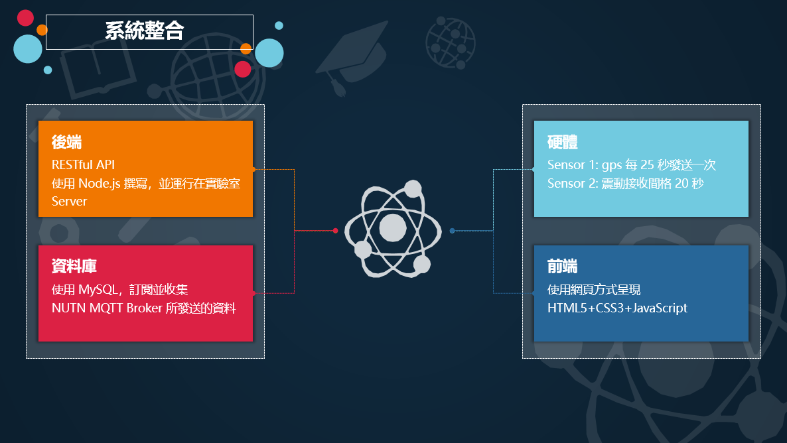
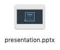

## 物聯網 LoRa 期末專案
課程： 108-2 物聯網

教師： 陳宗禧 教授

學生：
- 資工碩一 蔡易霖 M10759011
- 資工碩二 陳立中 M10659015

## [Demo](http://temportest.github.io/IoT-final-project)

 https://www.youtube.com/watch?time_continue=158&v=9pY0uXc8CCM

## 架構

## 簡報

